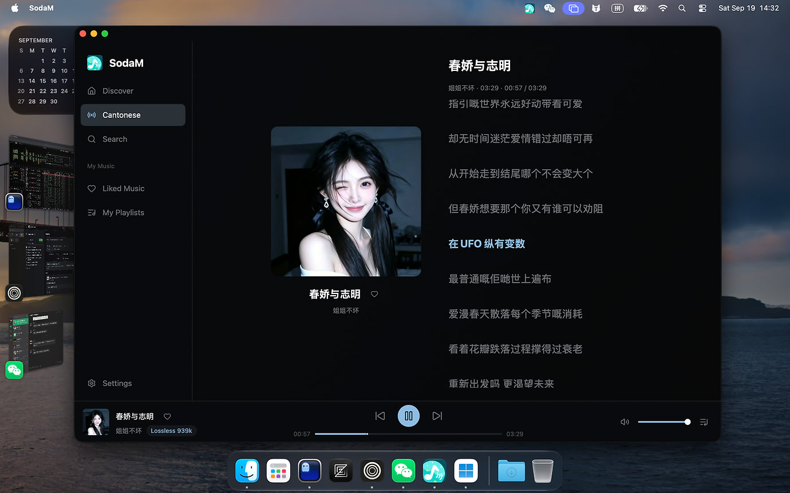
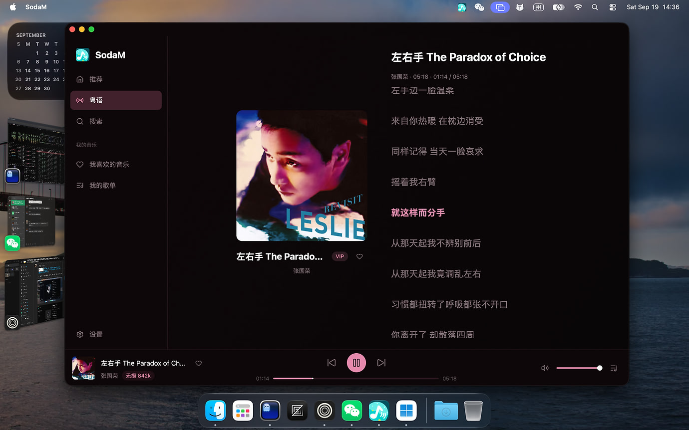
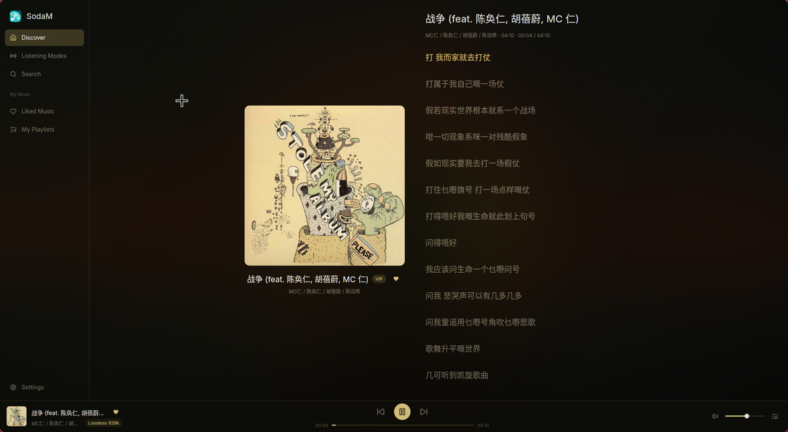
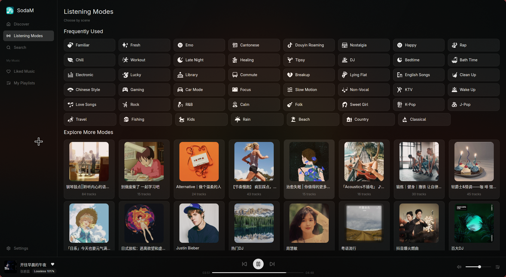
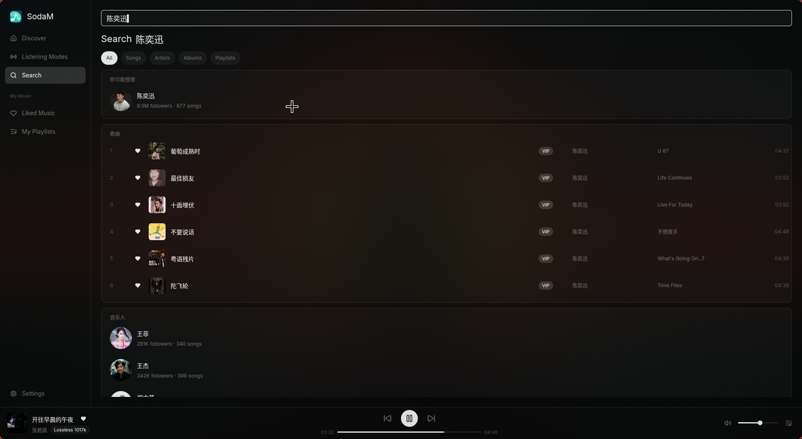
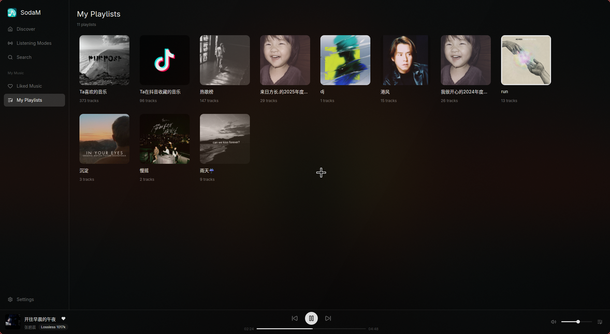
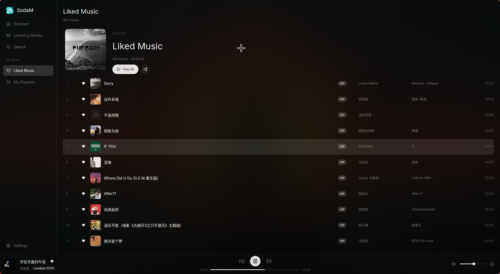
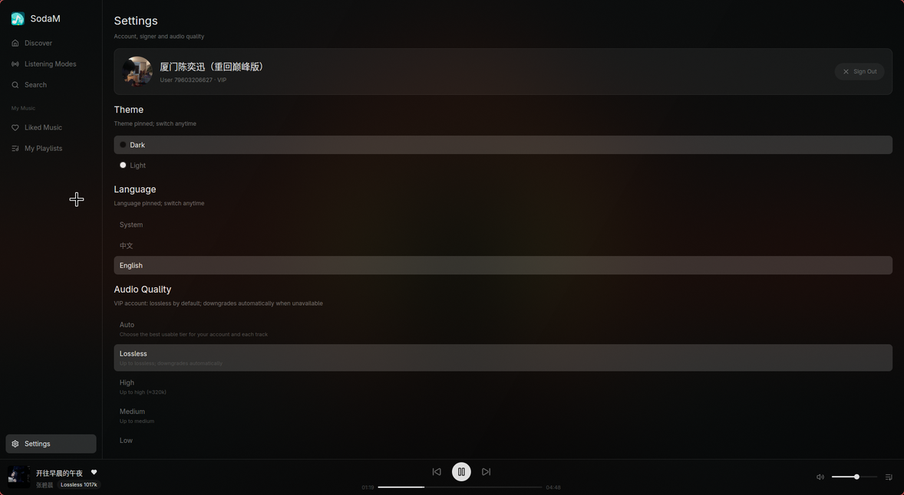
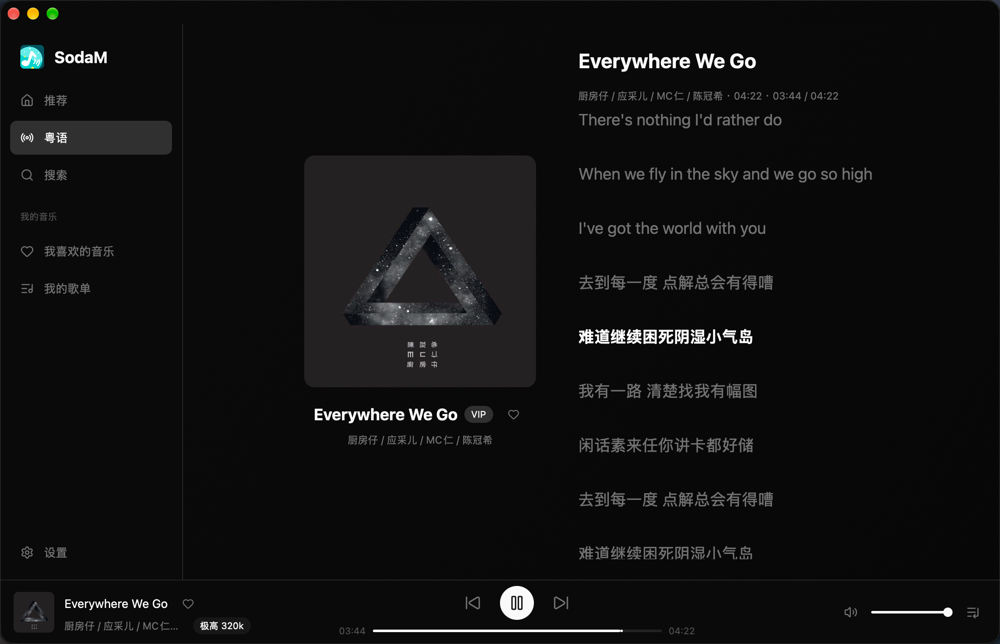
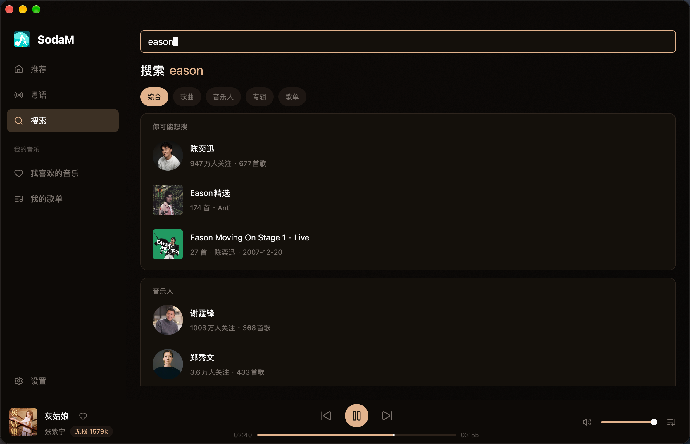

<div align="center">
  
  <h1>SodaM</h1>
  <p>基于 GPUI + Rust 的原生汽水音乐桌面客户端</p>
  <p>
    <a href="https://github.com/sodahub-org/sodam/blob/main/LICENSE"></a>
    <a href="https://www.rust-lang.org/"></a>
    <a href="https://github.com/sodahub-org/gpui"></a>
    <a href="https://omarchy.org/"></a>
    <a href="https://github.com/sodahub-org/sodam/releases"></a>
    
  </p>
  <p>音乐能力由 <a href="https://github.com/sodahub-org/libresoda">libresoda</a> 提供；应用签名服务可对接
    <a href="https://github.com/sodahub-org/libmssdk">libmssdk</a>。</p>
  <p>
    <a href="https://linux.do/t/topic/2921819">
      
      Linux.do 开源推广帖 · 问题反馈与交流
    </a>
  </p>
</div>

SodaM 面向 Linux / macOS / Windows 桌面，重点做四件事：**接近官方客户端的操作手感、稳定的本地播放体验、
会员账号的无损音质播放，以及干净自适应的主题系统**。

<div align="center">
  
</div>

<div align="center">
  
</div>

### 维护者与贡献者

<table align="center">
  <tr>
    <td align="center">
      <a href="https://github.com/zephyr-cheung">
        <br />
        <strong>ZephyrCheung</strong><br />
        Maintainer
      </a>
    </td>
    <td align="center">
      <a href="https://github.com/aBER0724">
        <br />
        <strong>aBER0724</strong><br />
        Contributor
      </a>
    </td>
  </tr>
</table>

### 平台支持

| 平台 | 状态 |
| --- | --- |
| Linux / Omarchy | 已实测 |
| macOS（Apple Silicon） | 已实测，提供 `.app` 下载 |
| Windows（x64） | 已实测，提供安装包 |

## 界面预览

| 推荐流 | 听歌模式 |
| --- | --- |
| <a href="docs/img/Discover.png"></a> | <a href="docs/img/Modes.png"></a> |
| **搜索** | **我的歌单** |
| <a href="docs/img/Search.png"></a> | <a href="docs/img/Playlists.png"></a> |
| **我喜欢的音乐** | **设置** |
| <a href="docs/img/Liked.png"></a> | <a href="docs/img/Settings.png"></a> |

### macOS（Apple Silicon）

| 听歌模式 | 推荐流 |
| --- | --- |
| <a href="docs/img/macos/Modes.png"></a> | <a href="docs/img/macos/Discover.png"></a> |
| **搜索** | **我的歌单** |
| <a href="docs/img/macos/Search.png"></a> | <a href="docs/img/macos/Playlists.png"></a> |
| **我喜欢的音乐** | **设置** |
| <a href="docs/img/macos/Liked.png"></a> | <a href="docs/img/macos/Settings.png"></a> |

## 功能特性

### 播放与队列

- 本地播放引擎：播放 / 暂停、上一首 / 下一首、拖动进度、音量控制
- 顺序、随机、单曲循环等队列模式
- 正在播放曲目在歌单列表中保持高亮
- 播放队列分为「已播放 / 正在播放 / 接下来」
- 队列与歌单中的歌曲支持右键菜单、下一首播放、收藏切换
- 歌名可跳转专辑页，歌手名可跳转音乐人页

### 播放页与歌词

- 官方式播放页布局：封面宽度 `min(40vh, 30vw)`，歌词列 `300–500px`
- 按当前歌曲封面提取主色，全局背景、表面色、强调色动态渐变
- 歌词随播放进度滚动，当前句居中高亮
- 播放页可在歌词视图与队列视图之间切换
- 封面与歌词加载失败时提供重试，并校验资源与当前歌曲是否匹配

### 推荐、听歌模式与音乐库

- 首页推荐队列，启动后自动准备第一首歌曲
- 45+ 听歌模式入口，图标本地内置，浅色 / 深色主题自动适配
- 探索歌单虚拟网格与分页加载
- 我喜欢的音乐、我的歌单、歌单详情、歌手页、专辑页
- 收藏状态在播放页、播放栏、队列和列表间保持同步

### 搜索

- 综合搜索与歌曲、音乐人、专辑、歌单垂直搜索
- 搜索结果支持多类型分组与详情页跳转
- 艺人页包含头像、热门歌曲、专辑与加载更多
- 专辑页展示封面、发行信息与全碟歌曲
- 输入框支持中文输入法与光标 / 选区操作

### 桌面体验

- Dark / Light 双主题，首次启动跟随系统偏好
- 中文 / English 界面语言，首次启动跟随系统语言
- 系统托盘：播放控制、显示主窗口、真正退出（Linux 为 SNI 托盘，macOS 为菜单栏 NSStatusItem，Windows 为通知区域图标）
- 关闭主窗口不退出进程，保留后台播放
- Linux 提供原生窗口与桌面入口；macOS 提供自绘标题栏的 `.app`；Windows 提供自绘标题栏（拖拽、双击最大化、Win11 贴靠布局）的安装包

### 性能与稳定性

- 网络请求、下载、解密、封面处理均放到后台线程，不阻塞渲染
- 长列表使用虚拟滚动，只渲染可见行
- 封面请求池有并发上限、去重和队列上限
- 播放请求带序号防竞态，过期结果不会覆盖当前歌曲
- 帧耗时与滚动压测开关可用于定位 UI 卡顿

## 架构与依赖

```text
SodaM
└── sodam-core        配置、会话、队列、播放引擎、音乐库封装；不依赖 GPUI
    └── libresoda     汽水接口、取流、解密、扫码登录、签名提供者
        └── libmssdk  可选应用签名服务，完整音质链路使用
```

分层细节见 [`docs/ARCHITECTURE.md`](docs/ARCHITECTURE.md)，
UI 规范见 [`docs/UI-SPEC.md`](docs/UI-SPEC.md)。

## 快速开始

### 环境要求

- Rust stable，最低 `1.85`
- Linux：Wayland 或 X11 运行时
- macOS：Apple Silicon（M 系列），macOS 12+；构建需完整版 Xcode（Metal shader 编译，
  仅装 Command Line Tools 会报 `xcrun: unable to find utility "metal"`）
- Windows：Windows 10+ x64；源码构建需 VS 2022 Build Tools（C++ 工作负载）
- Chromium / Chrome / Edge 等浏览器用于扫码登录签名页
- `libresoda` 与 `sodam` 同级 clone（可选）：本地联调时可用
  `[patch."https://github.com/sodahub-org/libresoda"]` 指向 `../libresoda`，
  改动 libresoda 即时生效，无需等新版本。

```text
Projects/sodahub-org/
├── libresoda/
├── libmssdk/
└── sodam/
```

### 启动

```bash
cd sodam
scripts/run.sh
```

首次启动进入设置页，扫码登录后配置会写入本地。已登录用户会直接进入播放页，
并自动准备推荐队列。

## 配置

配置文件（随平台不同）：

| 平台 | 路径 |
| --- | --- |
| Linux | `~/.config/sodam/config.json` |
| macOS | `~/Library/Application Support/sodam/config.json` |
| Windows | `%APPDATA%\sodam\config.json` |

环境变量只在配置字段为空时补全。常用配置：

| 变量 | 说明 |
| --- | --- |
| `SODA_COOKIE` | 登录 Cookie，扫码成功后自动写入配置 |
| `QISHUI_SIGNER_URL` | 签名服务 `/sign` 地址 |
| `QISHUI_SIGNER_TOKEN` | 签名服务 Bearer Token |
| `SODA_DEVICE_ID` / `SODA_IID` / `SODA_FP` | 设备身份；覆盖时必须与签名器一致 |
| `SODAM_QUALITY` | `best` / `lossless` / `highest` / `medium` / `low` |

SodaM 默认内置一个公共签名服务，未部署 `libmssdk` 的用户也可以直接使用。
可以在设置页或环境变量中替换为自己的签名服务。

不要提交真实 Cookie、Token、签名头或设备指纹。

## 开发

本仓库为了避免 ARM64 开发机编译峰值导致 OOM，所有常规操作都使用带资源护栏的脚本：

```bash
scripts/check.sh   # cargo check + fmt + clippy + test
scripts/build.sh   # debug / release 构建
scripts/run.sh     # 启动 GUI，带 MemoryMax 护栏
```

不要在 GUI 运行时编译；不要绕过脚本反复执行全量 cargo 构建。

## Arch Linux 下载安装

SodaM 的 GitHub Release 提供 Arch Linux `pacman` 安装包，当前版本为 [`v0.1.6`](https://github.com/sodahub-org/sodam/releases/tag/v0.1.6)。

### 1. 确认系统架构

```bash
uname -m
```

- `x86_64`：选择 `x86_64` 包
- `aarch64`：选择 `aarch64` 包，例如 ARM64 笔记本或 ARM 服务器

### 2. 下载并校验安装包

```bash
mkdir -p /tmp/sodam-install
cd /tmp/sodam-install

arch=$(uname -m)
version=0.1.6
base_url=https://github.com/sodahub-org/sodam/releases/download/v${version}

curl -fLO ${base_url}/SHA256SUMS
curl -fLO ${base_url}/sodam-${version}-1-${arch}.pkg.tar.zst
grep "sodam-${version}-1-${arch}\.pkg\.tar\.zst$" SHA256SUMS | sha256sum -c -
```

校验输出必须包含 `OK`：

```text
sodam-0.1.6-1-x86_64.pkg.tar.zst: OK
```

### 3. 安装

```bash
sudo pacman -U ./sodam-${version}-1-${arch}.pkg.tar.zst
```

`pacman` 会自动处理 `alsa-lib`、`dbus`、`fontconfig`、`freetype2`、`libxkbcommon` 等依赖。

### 4. 启动

命令行启动：

```bash
sodam
```

也可以从桌面环境的应用菜单中启动 **SodaM**。首次启动会进入设置页，按提示扫码登录后即可使用。

后续升级时，从 [Releases](https://github.com/sodahub-org/sodam/releases/latest) 下载新版本的对应架构包，并再次执行 `sudo pacman -U` 即可。

## macOS 下载安装（Apple Silicon）

macOS 版已在 Apple Silicon（M 系列）真机实测，GitHub Release 提供 `.app` 压缩包，
当前版本为 [`v0.1.6`](https://github.com/sodahub-org/sodam/releases/tag/v0.1.6)。

### 1. 下载并校验

```bash
mkdir -p /tmp/sodam-install
cd /tmp/sodam-install

version=0.1.6
base_url=https://github.com/sodahub-org/sodam/releases/download/v${version}

curl -fLO ${base_url}/SHA256SUMS
curl -fLO ${base_url}/sodam-${version}-macos-aarch64.zip
grep "sodam-${version}-macos-aarch64\.zip$" SHA256SUMS | shasum -a 256 -c -
```

校验输出必须包含 `OK`：

```text
sodam-0.1.6-macos-aarch64.zip: OK
```

### 2. 安装

```bash
unzip sodam-${version}-macos-aarch64.zip
mv SodaM.app /Applications/
```

也可以在 Finder 里双击解压后，把 **SodaM.app** 拖进「应用程序」文件夹。

### 3. 首次启动（绕过 Gatekeeper）

当前发行包为 ad-hoc 签名、未经 Apple 公证，首次打开会被 Gatekeeper 拦截，
任选一种方式放行：

```bash
# 方式一：去掉隔离属性（推荐）
xattr -cr /Applications/SodaM.app
open -a SodaM
```

或：双击 SodaM.app → 在弹窗中点「取消」→ 打开「系统设置 → 隐私与安全性」→
点「仍要打开」。

### 4. 启动

从启动台或 Finder 打开 **SodaM**，首次启动会进入设置页，按提示扫码登录后即可使用。
后续升级时，从 [Releases](https://github.com/sodahub-org/sodam/releases/latest) 下载新版本，
重复步骤 2 覆盖到 `/Applications` 即可（配置在
`~/Library/Application Support/sodam/`，不会丢失）。

## Windows 下载安装（x64）

Windows 版已在 Windows 10/11 x64 真机实测，GitHub Release 提供 Inno Setup 安装包
（按用户安装，无需管理员权限），当前版本为
[`v0.1.6`](https://github.com/sodahub-org/sodam/releases/tag/v0.1.6)。

### 1. 下载并校验

```powershell
mkdir C:\sodam-install; cd C:\sodam-install

$version = "0.1.6"
$base = "https://github.com/sodahub-org/sodam/releases/download/v$version"

Invoke-WebRequest "$base/SHA256SUMS" -OutFile SHA256SUMS
Invoke-WebRequest "$base/sodam-$version-windows-x64-setup.exe" -OutFile "sodam-$version-windows-x64-setup.exe"

$expected = (Select-String -Path SHA256SUMS -Pattern "sodam-$version-windows-x64-setup\.exe$").Line.Split(' ')[0]
$actual = (Get-FileHash "sodam-$version-windows-x64-setup.exe" -Algorithm SHA256).Hash.ToLower()
if ($expected -ne $actual) { throw "SHA256 mismatch!" } else { "SHA256 OK" }
```

输出 `SHA256 OK` 即校验通过。

### 2. 安装

双击运行安装包，按向导完成安装：

- 默认安装目录 `%LOCALAPPDATA%\Programs\SodaM`
- 自动创建开始菜单快捷方式，可选创建桌面快捷方式

### 3. 首次启动（SmartScreen 提示）

当前发行包未经代码签名，首次运行可能弹出
**「Windows 已保护你的电脑」**：点击「更多信息」→「仍要运行」即可。

首次启动会进入设置页，按提示扫码登录后即可使用。配置保存在
`%APPDATA%\sodam\config.json`，升级安装不会影响配置。

### 卸载

在「设置 → 应用」或「控制面板 → 程序和功能」中卸载 SodaM。

## 打包

```bash
cd packaging/arch
PKGEXT='.pkg.tar.zst' makepkg -f
sudo pacman -U ./sodam-<version>-<arch>.pkg.tar.zst
```

安装后会得到：

```text
/usr/bin/sodam
/usr/share/applications/sodam.desktop
/usr/share/icons/hicolor/256x256/apps/sodam.png
```

## 文档

- [`docs/ARCHITECTURE.md`](docs/ARCHITECTURE.md)：分层、线程、播放与导航架构
- [`docs/UI-SPEC.md`](docs/UI-SPEC.md)：主题、布局、尺寸与性能约束
- [`docs/ROADMAP.md`](docs/ROADMAP.md)：已完成能力与后续优先级

## 许可与合规

代码使用 AGPL-3.0-or-later。

SodaM 是独立项目，与字节跳动、抖音或汽水音乐无关。它只面向个人播放自己有权访问的
内容；不得用于公共代理、批量抓取、绕过付费限制或分发凭据。
